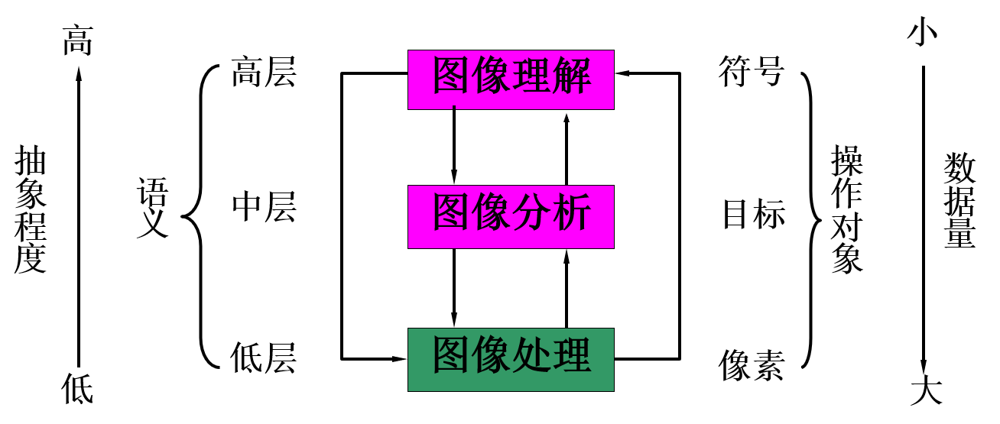

# 概述

## 基础知识

- 图(物理图像)

  物体透射或反射光的分布, 是客观存在的

  > 物质或能量的实际分布

- 像

  人的视觉系统对图的接受在大脑中形成的印象或反映

  > 有人的主观成分, such as optical illusion

- 图像

  图和像的有机结合, 是客观世界能量或状态以可视化形式在二维平面上的投影

> 客观 -> 人的主观感知

- 物理图像

  属于模拟图像

- 像素

  图像上被划分出的一个个小区域

  > 离散化的过程

  - 属性: 位置和灰度

- 数字图像

  以数字格式存放的图像, 传递事物状态的信息

- 数字化

  模拟图像 -> 为数字图像

  > 每个像素位置上, 图像的亮度被采样和量化, 一个区域变换成了一个数字

- 处理的目的

  - 提高视感质量, 为欣赏
  - 提取特征或特殊信息, 便于分析
  - 对图像数据进行变换、编码和压缩, 便于存储和传输

## 术语

- 数字图像处理

  图像到图像的变换

- 数字图像分析

  图像转化为非图像表示的变换

- 计算机图像学

  计算机对图像处理和显示

- 计算机视觉

  使计算机观察和理解电磁波分布的系统

- 扫描

  对一幅图像内的给定位置寻址

  > 对物体进行扫描 => 想象物体的光分布为一块块内存存储着光的信号, 然后扫描的过程就是对这些内存寻址取值

- 采样

  每个像素位置上测量灰度值

- 量化

  测量的灰度值用一个整数表示

## 内容

- 图像信息获取

  采集和获取

  图像 -> 数字信号

  > 摄取图像, A/D 转换, 数字化等步骤

  - 设备

    - CCD 摄像设备
    - 飞点扫描器
    - 扫描鼓
    - 扫描仪

- 信息的存储

  - 特点: 数字量巨大
  - 介质: 磁盘, 磁带, 光盘, 内存
  - 技术: 压缩, 编码, 图像格式, 数据库

- 数字图像处理

  - 几何处理

    坐标变换, 校正, `周长, 面积, 体积的计算`

  - 算术处理

    加减乘除, 逻辑运算, 灰度变换, 灰度级变换, 灰度级划分, 灰度级映射

  - 图像变换

    如傅里叶变换, 沃尔什变换, 离散余弦变换等

    频域中进行数字滤波处理

- 编码压缩

  编码是利用图像信号的统计特性及人类视觉的生理学及心理学特性对图像信号进行编码

  - 目的

    - 减少数据存储量
    - 降低码流以减少传输带宽
    - 压缩信息量, 便于识别和理解

    > 人看到的图像不是 0 和 1 或者电磁波那么细致, 而是被压缩过的

- 图像增强和复原

  > 如去除噪声, 提高图像的清晰度

- 图像分割

  图像中有意义的特征部分提取出来, 为进一步分析准备

  > 类似于人的`焦点`, 提取有效的信息

- 图像描述

  图像描述是图像识别和理解的必要前提

  > 如二维矩阵描述, 已有三维物体描述的研究, 如体积描述, 表面描述, 广义圆柱体描述等方法

- 图像识别

  属于模式识别的范畴

  主要内容: 图像经过某些预处理(如增强、复原、压缩) -> 图像分割和特征提取 -> 判决分类

- 图像理解

  由模式识别发展起来的方法

  输入是图像, 输出是一种描述

  - 描述

    不仅是单纯的用符号做出详细的描绘, 而且要根据客观世界的知识利用计算机进行`联想, 思考及推论`, 从而理解图像所表现的内容

## 方法

- 空域法

  图像$\Leftrightarrow$x , y 的像素的集合, 即看作$\left\{f(x,y)\right\}$

  - 邻域处理法

    梯度运算, 平滑算子运算和卷积运算

  - 点处理法

    灰度处理, `面积, 周长, 体积运算`等

- 变换域法

  图像 (正交变换) -> 变换域系数阵列 -> 处理(反变换) -> 空间域

  ```mermaid
  flowchart LR
    subgraph space_domain1["空间域"]
      image1["图像"]
    end
    subgraph transform_domain["变换域"]
      direction LR
      coefficient_array1["系数阵列"]
      coefficient_array2["系数阵列"]
    end
    subgraph space_domain2["空间域"]
      image2["图像"]
    end
    coefficient_array1 --"处理"--> coefficient_array2
    space_domain1 --"正交变换"--> transform_domain --"反变换"--> space_domain2
  ```

> 傅里叶变换

## 应用

- 视觉检测技术

## 特点

- 再现性好
- 处理精度高
- 适用领域广泛
- 灵活性高

  图像的光学处理从原理上讲只能进行线性运算, 而数字化不受限制

## 工程简述


