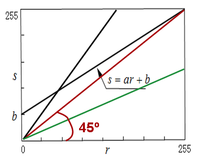
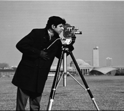
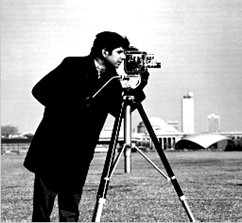
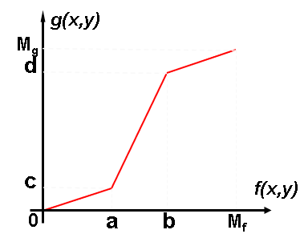
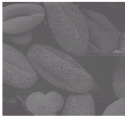
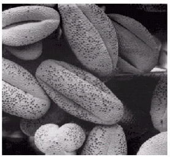
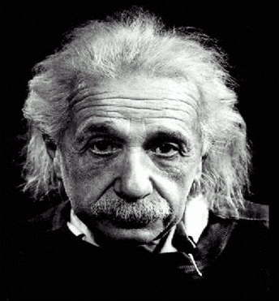
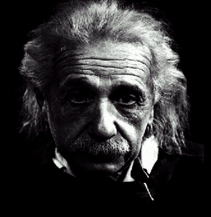

# 图像基本运算

## 概述

- 图像基本运算

  - 点运算(Point Operation)

    每个像素点的灰度值进行计算

  - 代数运算(Algebra Operation)

    将两幅或多幅图像通过对应像素进行代数运算

  - 逻辑运算(Logical Operation)

    将两幅或多幅图像通过对应像素进行逻辑运算

  - 几何运算(Geometric Operation)

    改变图像中物体对象(像素)之间的空间关系

## 点运算

- 定义

  $$g(x, y) = T(f(x, y))$$

  或者设$r = f(x, y)$, $s = g(x, y)$, 则

  $$s = T(r)$$

点运算又称为"对比度增强","对比度拉伸","灰度变换"等

- 分类

  ```markmap
  - 点运算
    - 灰度变换增强
      - 线性
      - 分段线性
      - 非线性
    - 直方图增强
  ```


### 线性点运算

$$ s = ar + b $$

- 线性方程的参数性质

  

  |     parameter      |       effect       |
  | :----------------: | :----------------: |
  | $0 < a < 1, b > 0$ |      灰度压缩      |
  |   $a = 1, b = 0$   |      灰度不变      |
  |   $a > 1, b = 0$   |      灰度扩展      |
  | $0 < a < 1, b = 0$ | 灰度压缩, 整体变暗 |

- 应用

|             对比度增大              |            加亮,减暗图像            |
| :---------------------------------: | :---------------------------------: |
|  |  |

|               before                |         transform function          |                after                |
| :---------------------------------: | :---------------------------------: | :---------------------------------: |
|  |  |  |

经过变换后, 对比增强, 因为背景色是偏灰的, 人物是偏黑的, 经过处理后, 这种却别更加明显了

- 对比度降低的效果

  比如模拟充满雾气的朦胧效果

- 反转颜色

  $$s = 255 - r$$

  比如用于浏览器的 dark theme

### 分段线性

> 觉得和线性有些类似

目的: 将感兴趣的灰度范围线性扩展，相对抑制不感兴趣的灰度区域



$[0, a]$和$[b, M_r]$被压缩了(对比上面的是完全被压缩了), 而感兴趣的$[a, b]$被扩展了

|               before                |                after                |
| :---------------------------------: | :---------------------------------: |
|  |  |

不感兴趣的信息没有被丢失, 仅仅是压缩了

### 非线性点运算

常见的为`对数变换`和`幂次变换`

- 对数变换


  $$s = \text{log}(1+r)$$

  低灰度区扩展, 高灰度区压缩. 图像加亮, 减暗

  |               before                |                after                |
  | :---------------------------------: | :---------------------------------: |
  |  |  |

- 幂次变换

  $$ s = C r^{\gamma} $$

  |    parameter    |   effect   |
  | :-------------: | :--------: |
  | $0< \gamma < 1$ | 加亮, 减暗 |
  |  $\gamma > 1$   | 加暗, 减亮 |

  加暗, 减亮的效果

  |               before                |                after                |
  | :---------------------------------: | :---------------------------------: |
  |  |  |

## 代数

### 加法运算

- 去除"叠加性"随机噪音

  设 $g_i(x, y)$ 为混入噪音的图像, $f(x, y)$为原始图像, $e_i(x, y)$噪音

  $$g_i(x, y) = f(x, y) + e_i(x, y) $$

  求平均:

  $$\bar{g}(x, y)=\frac{1}{N}\sum_{i=1}^{N} g_i(x, y)=f(x, y)+\frac{1}{N}\sum_{i=1}^{N} e_i(x, y)$$

  假设噪音是独立无关的, 均值为 0, 则求均值可以降低噪音的干扰

  > 有点奇妙, 第一感觉是, 不断加有噪音的图片不会越来越偏离原始图像吗, 没有考虑到用概率考虑无序, 竟然可以巧妙地趋于有序

- 生成图像叠加效果

  比如游戏的背景图

### 减法运算

将同一景物在不同时间拍摄的图像或同一景物在不同波段的图像相减

> 常称为差影法, 提供了图像间的差值信息, 能用于指导动态监测, 运动目标的检测和跟踪, 图像背景的消除及目标识别等

- 差影法(检测同一场景两幅图像之间的变化)

  > 找不同

- 混合图像的分离

  去除不需要的叠加性图案


- 应用

  - 差影法

    银行金库监控: 每隔一段时间与上一幅图像作差影, 差别超过阈值则报警

    检测灾情: 火灾, 河口泥沙, 海岸污染

    鉴别耕地和农作物覆盖

  - 分离混合图像

    消除背景干扰, 如医学图像, 分离出关心的组织图像

### 乘法运算

- 图像的局部显示

  $$Q ( i , j ) = P _ { 1 } ( i , j ) \times P _ { 2 } ( i , j )$$

  如蒙版显示

  |             $P_1(i, j)$             |             $P_2(i, j)$             |              $Q(i, j)$              |
  | :---------------------------------: | :---------------------------------: | :---------------------------------: |
  |  |  |  |

- 改变图像的灰度级

  用于遥感图像处理

### 除法运算

可用于改变图像的灰度级,常用于遥感图像处理中

### 复合运算

$$Q ( i , j ) = \alpha \times P _ { 1 } ( i , j ) + ( 1 - \alpha ) \times P _ { 2 } ( i , j )$$

> $\alpha$为透明度

## 逻辑运算

用于比如, 两个矩形的合并, 相交, 差集等, 类似于集合 Venn 图, 对图形的区域进行运算

- 使指定区域变亮

## 几何运算

$$g ( x , y ) = f ( u , v ) = f ( p ( x , y ) , q ( x , y ) )$$

> $u = p ( x , y ) , v = q ( x , y )$唯一地描述了空间变换, 即图像$f(u, v)$从$u-v$坐标系变换为$x-y$坐标系的图像$g(x, y)$

可以看矩阵的 2D 变换: 平移, 旋转, 镜像, 缩放等矩阵形式

由于图像是离散的, 变换的时候, 会有信息不足, 出现空点, 这时候需要用插值处理

其中还涉及图像的裁剪
