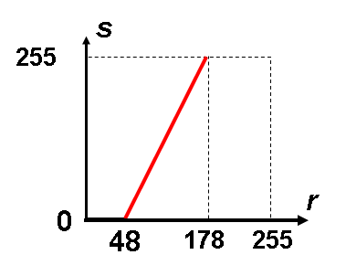
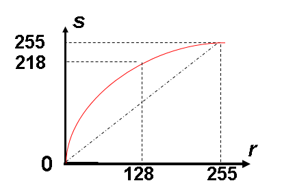

# 图像基本运算

## 概述

- 图像基本运算

  - 点运算(Point Operation)

    每个像素点的灰度值进行计算

  - 代数运算(Algebra Operation)

    将两幅或多幅图像通过对应像素进行代数运算

  - 逻辑运算(Logical Operation)

    将两幅或多幅图像通过对应像素进行逻辑运算

  - 几何运算(Geometric Operation)

    改变图像中物体对象(像素)之间的空间关系

## 点运算

- 定义

  $$g(x, y) = T(f(x, y))$$

  或者设$r = f(x, y)$, $s = g(x, y)$, 则

  $$s = T(r)$$

点运算又称为"对比度增强","对比度拉伸","灰度变换"等

- 分类

  ```markmap
  - 点运算
    - 灰度变换增强
      - 线性
      - 分段线性
      - 非线性
    - 直方图增强
  ```

```markmap
# markmap

## Links

- <https://markmap.js.org/>
- [GitHub](https://github.com/gera2ld/markmap)

## Related Projects

- [coc-markmap](https://github.com/gera2ld/coc-markmap)
- [gatsby-remark-markmap](https://github.com/gera2ld/gatsby-remark-markmap)

## Features

- links
- **strong** ~~del~~ *italic* ==highlight==
- multiline
  text
- `inline code`

- Katex
  - $x = {-b \pm \sqrt{b^2-4ac} \over 2a}$
  - [More Katex Examples](#?d=gist:af76a4c245b302206b16aec503dbe07b:katex.md)
- Now we can wrap very very very very long text based on `maxWidth` option
```

### 线性点运算

$$ s = ar + b $$

- 应用

|             对比度增大              |            加亮,减暗图像            |
| :---------------------------------: | :---------------------------------: |
|  |  |

### 非线性点运算

常见的为`对数变换`和`幂次变换`

- 对数变换

  低灰度区扩展, 高灰度区压缩. 图像加亮, 减暗

- 应用
- 傅里叶变换

## 代数

### 加法运算

- 去除"叠加性"随机噪音
- 生成图像叠加效果

### 减法运算

将同一景物在不同时间拍摄的图像或同一景物在不同波段的图像相减

> 常称为差影法, 提供了图像间的差值信息, 能用于指导动态监测, 运动目标的检测和跟踪, 图像背景的消除及目标识别等

- 差影法(检测同一场景两幅图像之间的变化)

  > 找不同

- 混合图像的分离

  去除不需要的叠加性图案

### 乘法运算

- 图像的局部显示

  $$Q ( i , j ) = P _ { 1 } ( i , j ) \times P _ { 2 } ( i , j )$$

  如蒙版显示

- 改变图像的灰度级

### 除法运算

可用于改变图像的灰度级,常用于遥感图像处理中

### 复合运算

$$Q ( i , j ) = X \times P _ { 1 } ( i , j ) + ( 1 - X ) \times P _ { 2 } ( i , j )$$

## 逻辑运算

"与","或"逻辑运算可以从一幅图像中提取子图像

- 使指定区域变亮

## 几何运算

$$g ( x , y ) = f ( u , v ) = f ( p ( x , y ) , q ( x , y ) )$$

> $u = p ( x , y ) , v = q ( x , y )$唯一地描述了空间变换, 即图像$f(u, v)$从$u-v$坐标系变换为$x-y$坐标系的图像$g(x, y)$
