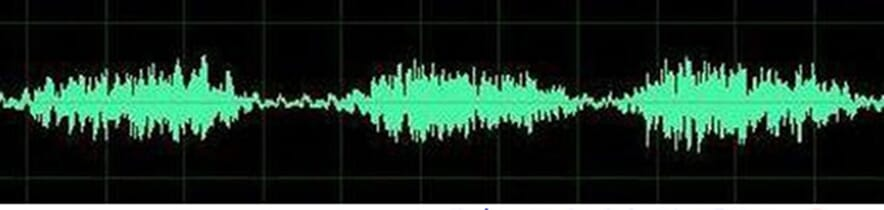
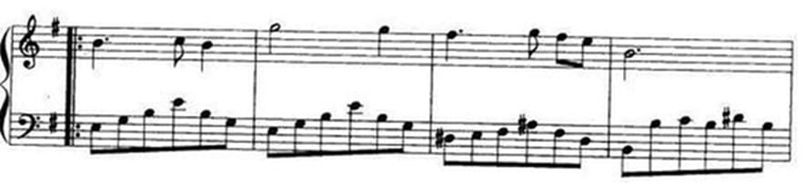
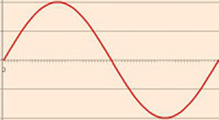
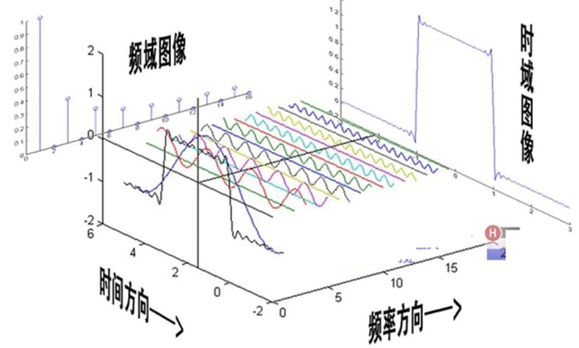
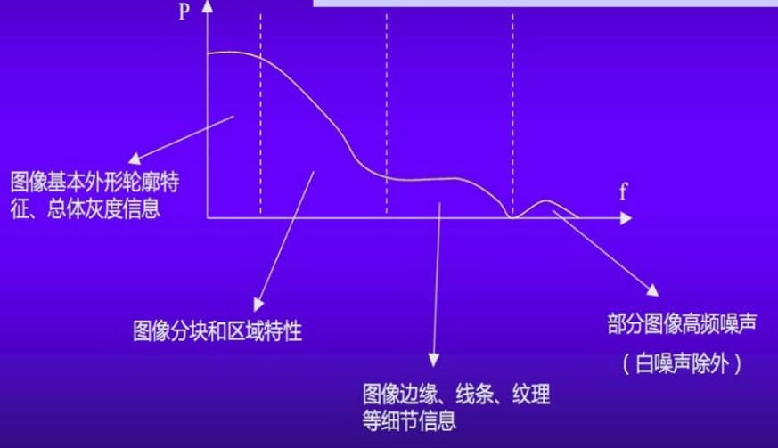
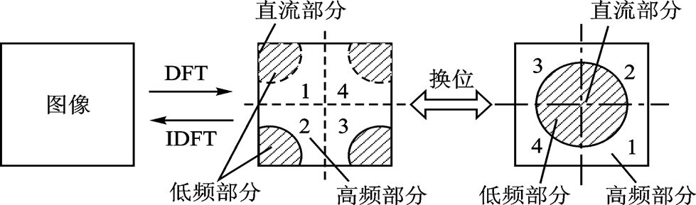

# 图像变换

Image Transform

基本思路: 原定义在图像空间的图像以某种形式转换到其他空间, 利用图像在这个空间的特有性质进行处理, 然后通过逆变换操作转换到图像空间

可以将傅里叶变换比作一个玻璃棱镜。棱镜是可以将光分解为不同颜色的物理仪器，每个成分的颜色由波长（或频率）来决定

- 频率

  通常是指某个一维物理量随时间变化快慢程度的度量

  > 一些形象的理解

  |                时域                 |                频域                 |
  | :---------------------------------: | :---------------------------------: |
  |  |  |
  |       普通人对音乐的直观理解        |    音乐专业人士对音乐的直观理解     |
  |            随时间变化的             |           在频率上静止的            |
  |  |  |
  |        琴弦的在时域上的振动         |      在频率上是一个永恒的音符       |

  > 两个时空放置在一起

  

- 图像

  二维信号

  所在的域称为空间域（Space Domain）

  - 空间频率（Spatial Frequency）

    图像灰度值随空间坐标变化的快慢

    含义: 表征图像中灰度变化剧烈程度的指标, 灰度在平面空间上的梯度

    > 与梯度有了联系

- 傅立叶变换的物理意义

  将图像的灰度分布函数变换为图像的频率分布函数

  > 把频率用梯度替换试试

## 图像变换

- 方法

  对图象信息进行变换，使能量保持但重新分配

- 目的

  有利于加工、处理滤除不必要信息(如噪声)，加强/提取感兴趣的部分或特征

- 方法分类

  可分离、正交变换

  2D-DFT, 2D-DCT, 2D-DHT, 2D-DWT

图像信号的频域模型:

变换后的图象, 大部分能量都分布于低频谱段, 这对以后图象的压缩传输都比较有利. 使得运算次数减少, 节省时间

### 用途

- 提取图象特征

  - 直流分量：$f(x,y)$的平均值$=F(0,0)$
  - 目标物边缘：$F(u,v)$高频分量

- 图像压缩

  正交变换能量集中，对集中（小）部分进行编码

- 图象增强

  低通滤波，平滑噪声；高通滤波，锐化边缘

## 连续傅里叶变换

Continuous Fourier Transform

### two demensional

> 重点强调二维

$$\mathcal{F} \{ f ( x , y ) \} = F ( u , v ) = \int _ { - \infty } ^ { \infty } \int _ { - \infty } ^ { \infty } f ( x , y ) e ^ { - j 2 \pi ( ux + v y ) } d x d y$$

$$\mathcal{F} ^ { - 1 } \{ F ( u , v ) \} = f ( x , y ) = \int _ { - \infty } ^ { \infty } \int _ { - \infty } ^ { \infty } F ( u , v ) e ^ { j 2 \pi ( ux + vy ) } d u d v$$

- extend reading

  - Fourier transform. (2022, October 11). In Wikipedia. https://en.wikipedia.org/wiki/Fourier_transform

  - [n-dimensional Fourier Transform](https://see.stanford.edu/materials/lsoftaee261/chap8.pdf)

## 离散傅里叶变换

Discrete Fourier Transform

!> $\mathcal{R}$ is similiar to $\mathcal{F}$. It means discrete Fourier transform instead of the Real Numbers.

### one dimensional

$$\mathcal{R}: F ( u ) = \sum _ { x = 0 } ^ { N - 1 } f ( x ) e ^ { - j 2 \pi u x / N }$$

$$\mathcal{R ^ { - 1 }}: f ( x ) = \frac { 1 } { N } \sum _ { u = 0 } ^ { N - 1 } F ( u ) e ^ { j 2 \pi u x / N }$$

定义算子符号:

$$W _ { N } ^ { u x } = e ^ { - j \frac { 2 \pi } { N } u x }$$

$W _ { N } ^ { x }$的性质:

- 周期性

  $W _ { N } ^ { x } = W _ { N } ^ { x + N }$

- 对称性

  $$W _ { N / y } ^ { x / y } = W _ { N } ^ { x }$$

  $$W _ { N } ^ { u + N / 2 } = W _ { N } ^ { u } \cdot W _ { N } ^ { N / 2 } = W _ { N } ^ { u } \cdot ( - 1 ) = - W _ { N } ^ { u }$$

  > 用$I^{\frac {x} {N} }$代替$W _ { N } ^ { x }$更好

  如:

  $$ I^{\frac {N/2} {N}} = I^{1/2} = -1$$

### two dimensional

$$\mathcal{R}: F ( u , v ) = \sum _ { x = 0 } ^ { M - 1 } \sum _ { y = 0 } ^ { N - 1 } f ( x , y ) e ^ { - j 2 \pi ( \frac {ux} {M} + \frac {vy} {N} ) }$$

$$\mathcal{R ^ { - 1 }}: f ( x , y ) = \frac { 1 } { MN } \sum _ { u = 0 } ^ { M - 1 } \sum _ { v = 0 } ^ { N - 1 } F ( u , v ) e ^ { j 2 \pi ( \frac {ux} {M} + \frac {vy} {N} ) }$$

> 图像处理中, 一般$M=N$, 所以一般采用以下形式, 对系数进行调整

$$F ( u , v ) = \frac { 1 } { N } \sum _ { x = 0 } ^ { N - 1 } \sum _ { y = 0 } ^ { N - 1 } f ( x , y ) e ^ { - j 2 \pi ( \frac {ux + vy} {N} ) }$$

$$f ( x , y ) = \frac { 1 } { N } \sum _ { u = 0 } ^ { N - 1 } \sum _ { v = 0 } ^ { N - 1 } F ( u , v ) e ^ { j 2 \pi ( \frac {ux + vy} {N} ) }$$

### 图像傅里叶变换

> 对图像进行二维傅立叶变换得到频谱图，就是图像梯度的分布图, 是图像上某一点与邻域点差异的强弱

频谱图(也叫功率图)，就可以看出图像的能量分布

将$f(x, y)$ 乘上因子$(-1)^{(x+y)}$进行换位:

数学原理: 利用平移性质

$$F ( u - u _ { 0 } , v - v _ { 0 } ) \Leftrightarrow f ( x , y ) e ^ { j 2 \pi ( \frac { u_{0}x + v_{0}y } { N } ) }$$

当$u_{0}=v_{0}=\frac{N}{2}$时，频谱图的中心为原点，即:

$$F ( u - \frac{N}{2} , v - \frac{N}{2} ) \Leftrightarrow f ( x , y ) e ^ { j \pi ( x + y ) } = f ( x , y ) (-1)^{x+y}$$

- 便于观察频率分布
- 可以分离出周期性规律的感染

  如若有正弦干扰, 则会在其他位置出现亮点重心, 可以使用滤波器消除

### reference

- Discrete Fourier transform. (2022, August 4). In Wikipedia. https://en.wikipedia.org/wiki/Discrete_Fourier_transform

## 快速傅里叶变换

!> 并不是一种新的变换，它是离散傅里叶变换(DFT)的一种算法

在分析离散傅里叶变换(DFT)中的多余运算的基础上，进而消除这些重复工作的思想指导下得到的，得到的快速算法

基本思想: 就是充分利用 DFT 的周期性和对称性，减少重复的计算量；并把 N 点长序列分成几个短序列，减少每个序列长度

将二维的形式分解

$$
\begin{aligned}
F ( u , v ) &= \frac { 1 } { N } \sum _ { x = 0 } ^ { N - 1 } \sum _ { y = 0 } ^ { N - 1 } f ( x , y ) e ^ { - j 2 \pi ( \frac {ux + vy} {N} ) } \\
&= \frac { 1 } { N } \sum _ { x = 0 } ^ { N - 1 } e ^ { - j 2 \pi ( \frac {ux} {N}) } \sum _ { y = 0 } ^ { N - 1 } f ( x , y ) e ^ { - j 2 \pi ( \frac {vy} {N} ) } \\
&= \frac { 1 } { N } \sum _ { x = 0 } ^ { N - 1 } e ^ { - j 2 \pi ( \frac {ux} {N}) } g ( x, v )
\end{aligned}
$$

于是$F(u, v)$分解成了两个一维的傅里叶变换

$$F(u, v) = \mathcal{R}(f(x,y)) = \mathcal{R_x}(\mathcal{R_y}(f(x,y))$$

## 傅里叶变换的性质

## 图像傅里叶变换实例

## 其他离散变换
