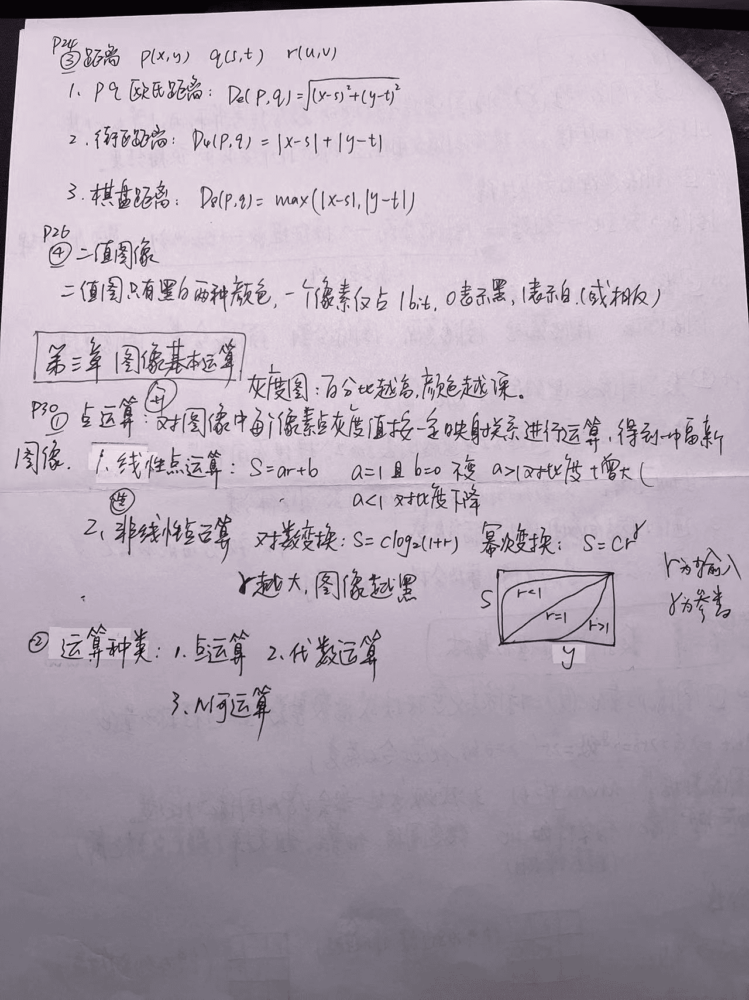

# 复习

## 题型

| 类型 |               题型               | 分值  | 时间  |
| :--: | :------------------------------: | :---: | :---: |
| 开卷 |          matlab (2 道)           | 60 分 | 80min |
| 闭卷 | 选择题(5 道)+名词解释+简答(2 道) | 40 分 | 40min |


## 复习





## 编程

读取图片

```matlab
% 读取图片
I = imread('cameraman.png');
% 显示图片
imshow(I);
```

## 题目一

1. 文件打开彩图, 提取 RGB
2. RGB -> HSI
3. HSI 进行平滑
4. 平滑后的 HSI -> RGB

```matlab
% 彩色图像的平滑处理
f = imread('flower.tif');
figure,imshow(f);

%f的RGB三个分量
f1 = f(:,:,1);
f2 = f(:,:,2);
f3 = f(:,:,3);
figure,imshow(f1);
figure,imshow(f2);
figure,imshow(f3);

%对f的三个分量单独进行平滑处理
w = fspecial('average',25);
f1_filtered = imfilter(f1,w,'replicate');
f2_filtered = imfilter(f2,w,'replicate');
f3_filtered = imfilter(f3,w,'replicate');
f_filtered = cat(3,f1_filtered,f2_filtered,f3_filtered);
figure,imshow(f_filtered);

%将RGB版本转化为HSI版本（后面程序中包含单单对亮度分量进行
%平滑处理，和对三个分量平滑处理的模糊处理）
%分别显示色调、饱和度分量和亮度分量
h = rgb2hsi(f);
H = h(:,:,1);
S = h(:,:,2);
I = h(:,:,3);
figure,imshow(H);
figure,imshow(S);
figure,imshow(I);

%单单对亮度分量进行平滑处理
w = fspecial('average',25);
I_filtered = imfilter(I,w,'replicate');
h = cat(3,H,S,I_filtered);
figure,imshow(h);

%将单单对亮度分量进行平滑处理的hsi图像转化为rgb图像
f = hsi2rgb(h);
figure,imshow(f);

%对HSI的三个分量都进行平滑处理,并转化为RGB图像
H_filtered = imfilter(H,w,'replicate');
S_filtered = imfilter(S,w,'replicate');
h1 = cat(3,H_filtered,S_filtered,I_filtered);
figure,imshow(h1);

%将hsi图像转化为rgb图像
f4 = hsi2rgb(h1);
figure,imshow(f4);
```

## 题目二

1. 指定区域生成彩图
2. 进行均值滤波

```matlab
clear all;
clc;
I=imread('up4-Amp.png');
OutImg=I;
R=I(:,:,1);
G=I(:,:,2);
B=I(:,:,3);

R=medfilt2(R,[3,3]);
G=medfilt2(G,[3,3]);
B=medfilt2(B,[3,3]);

I1=cat(3,R,G,B);  % 对彩色图像R,G，B三个通道分别进行3×3模板的中值滤波 cat函数用于连接两个矩阵或数组

R=filter2(fspecial('average',3),R)/255;
G=filter2(fspecial('average',3),G)/255;
B=filter2(fspecial('average',3),B)/255;
I2= cat(3,R,G,B);  %对彩色图像R,G，B三个通道分别进行3×3模板的均值滤波
figure,imshow(I);
title('原图')

figure,
imshow(I1);
title('中值滤波')

figure,imshow(I2);
title('均值滤波')
```

## 题目三

1. 彩图
2. 分量
3. 分量减半
4. 合成彩图

```matlab
I=imread('up4-Amp.png');
R=I(:,:,1);
G=I(:,:,2);
B=I(:,:,3);
Ra=R/2;
Ga=G/2;
Ba=B/2;
I1=cat(3,Ra,Ga,Ba);
figure,imshow(I);
title('原图')
```
